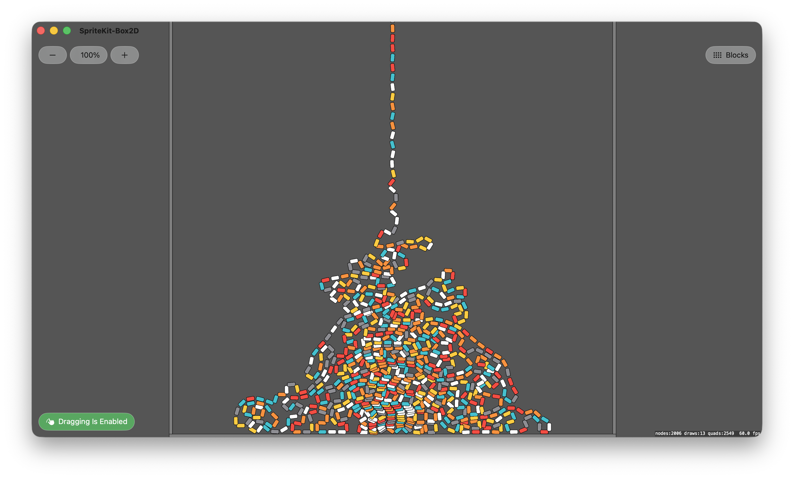
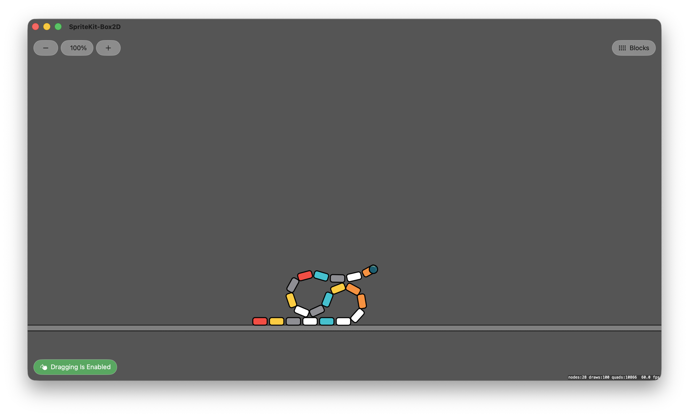
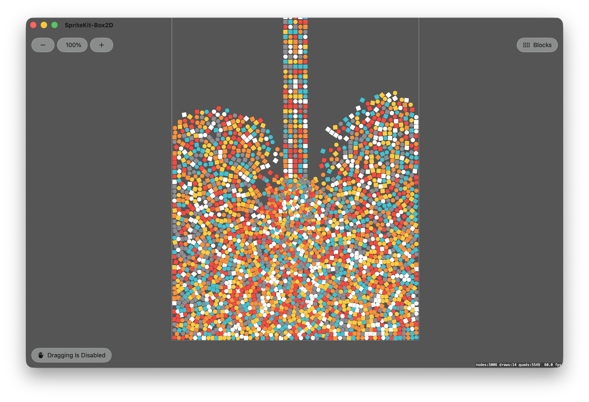
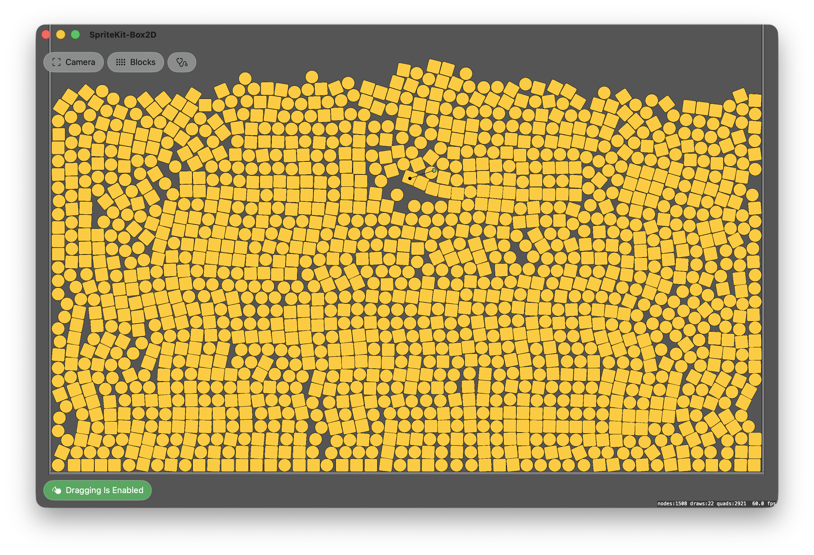

# SpriteKit Box2D

This project integrates Box2D version 3 with SpriteKit.

## Run The App

- You need a Mac with Xcode, and optionally an iOS device.
- Download this project and open it in Xcode.
- Update signing to use your own Apple Developer account.
- Select a target device or simulator.
- For best performance, run the app with the scheme set to Release instead of Debug.
- Build and run.
- Enjoy amazing Box2D with lovely SpriteKit.

## Minimal Setup

To run Box2D with SpriteKit, a scene can be structured as follows:

- Create a Box2D world.
- Create SpriteKit visual nodes. SpriteKit is used for rendering.
- For each visual node, create a Box2D body with a collision shape that represents it in the simulation.
- Link each SpriteKit node to its Box2D body. For example, create an `Entity` struct that references both, then store entities in an array or dictionary.
- Step the Box2D simulation with a fixed timestep, typically 1/60 second.
- After each Box2D step, sync the simulation result back to SpriteKit by applying Box2D body transforms to SpriteKit nodes.

For a minimal setup, stepping Box2D directly from SpriteKit `update(_:)` is enough. For a production app, use a fixed-step accumulator so Box2D receives the same timestep even if SpriteKit renders at 60 fps, 120 fps, or with occasional frame drops.

## Update and Fixed Update

A physics engine advances with a given increment of time called a timestep, typically 1/60 second. In Box2D, the method that tells the engine to simulate one additional increment of time is called `step`, and it takes a timestep.

Usually, the goal of the simulation is to stay in sync with real time. 3 seconds of wall-clock time should simulate 3 seconds of physics time. But if we call `step` directly from `update(_:)`, we depend on how steady the render refresh cycle is: a frame may take too long before calling the next update, or the device might be running at 120fps, twice the physics rate.

If we pass the same timestep regardless of rendering speed, we may get slow/fast physics motion depending on update speed. If we pass a variable timestep to the physics engine, we won't get similar results, because a physics solver doesn't yield the same outcome from different increments of time.

We need a fixed update. A fixed update is a function that advances the physics engine using a stable timestep. A common way to implement it is with the accumulator pattern, documented in Glenn Fiedler's famous [Fix Your Timestep!](https://gafferongames.com/post/fix_your_timestep/) post. It works like this:

- Each render update, calculate how much real time passed since the previous update.
- Add that delta time to an accumulator.
- If the accumulator is greater than or equal to the fixed timestep, run one fixed update.
- Subtract one fixed timestep from the accumulator.
- If the accumulator is still greater than or equal to the fixed timestep, run another fixed update.
- If the accumulator is smaller than the fixed timestep, stop and let the render update continue.

In this pattern, the rendering engine may provide variable time, and the accumulator converts it into fixed physics steps.

With SpriteKit, the implementation looks like this:

```swift
class MyScene: SKScene {

    private let fixedTimestep: TimeInterval = 1 / 60
    private var lastUpdateTime: TimeInterval?
    private var accumulatedTime: TimeInterval = 0

    override func update(_ currentTime: TimeInterval) {
        /// Calculate delta time
        guard let lastUpdateTime else {
            lastUpdateTime = currentTime
            return
        }
        let deltaTime = currentTime - lastUpdateTime
        self.lastUpdateTime = currentTime

        /// Accumulate time from display refresh cycle
        accumulatedTime += deltaTime

        /// Run code that updates once per rendered frame
        //..
        
        /// Check if enough real time has passed to run fixed update
        while accumulatedTime >= fixedTimestep {
            /// Run code on fixed time steps
            fixedUpdate(fixedTimestep)
            accumulatedTime -= fixedTimestep
        }
    }
    
    func fixedUpdate(_ fixedTimestep: TimeInterval) {
        /// Run the Box2D simulation with a fixed time increment
        b2DWorld.step(Float(fixedTimestep), subSteps: 4)
    }

}
```

Notice that:

- SpriteKit's `update(_:)` passes the current time, not delta time, so we calculate delta time ourselves.
- Per-frame code can run before or after the fixed update. Choose the order that matches your app.
- Box2D should receive the same fixed timestep each step.

In this project, I call fixed update from didSimulatePhysics, not directly from update(_:). didSimulatePhysics is called after SpriteKit has evaluated actions and simulated its own physics. This lets the app pass SpriteKit action or physics results into Box2D before stepping Box2D, if needed later.

## Timestep

The physics engine doesn't have to run in sync with real-time. We could speed up or slow down the rate at which each step is called, using a time scale parameter:

```swift
class MyScene: SKScene {

    /// 1 = normal speed, 0.5 = slow motion, 2 = fast forward.
    private var timeScale: CGFloat = 1
    
    override func update(_ currentTime: TimeInterval) {
        ///...

        /// Use the time scale for accumulating time
        accumulatedTime += deltaTime * timeScale
        
        ///...
    }
}
```

If we use a time scale of 2, the physics engine will step twice more, i.e. it will simulate 2 seconds in 1 second of real-time. How fast can it get? As fast as the computer can process a step.

What happens if we use a time scale of 0.5 or 0.1? We will get physics at 30fps or 6fps, respectively. The motion will be jagged, unless the rendering engine does visual interpolation between each step ("make up frames"). But we would still get the same result, because the timestep hasn't changed.

What happens if we use different timesteps? 

## Swift and C

Making SpriteKit and Box2D v3.x.x work together is surprisingly approachable. Thanks to Luiz Fernando's wrapper, You mostly use a Swift-like syntax on top of Box2D C API.

You could make your own wrapper or bridge. Add the original source code of Box2D directly inside your Xcode project, and the C API to Swift.

This is possible because C and C++ are first class languages in Xcode and Mac. Xcode can compile them, and many of Apple's own framework use C. SpriteKit itself is an Objective-C engine. Objective-C is a superset of C.

## Screenshots

A chain of 2000 colliding bodies linked with revolute joints:


A short chain of colliding bodies linked with revolute joints:


5000 colliding bodies falling under gravity:


1500 stacked bodies, one body dragged with a motor joint:


## Videos

- [Falling Chain - 2](https://www.achrafkassioui.com/images/SpriteKit%20-%20Box2D%20v3%20-%20Falling%20Chain%20-%202.mov) (43MB)
- [Falling Chain - 1](https://www.achrafkassioui.com/images/SpriteKit%20-%20Box2D%20v3%20-%20Falling%20Chain%20-%201.mov) (14MB)
- [Long Chain with Revolute Joint - With Self Collision](https://www.achrafkassioui.com/images/SpriteKit%20-%20Box2D%20v3%20-%20Chain%20Revolute%20With%20Collision.mov) (263MB)
- [Long Chain with Revolute Joint - No Self Collision](https://www.achrafkassioui.com/images/SpriteKit%20-%20Box2D%20v3%20-%20Chain%20Revolute%20No%20Collision.mov) (87MB)
- [Chain with Revolute Joint - High Damping - 1](https://www.achrafkassioui.com/images/SpriteKit%20-%20Box2D%20v3%20-%20Chain%20with%20Rovolute%20-%201.mov) (28MB)
- [Chain with Revolute Joints - High Damping - 2](https://www.achrafkassioui.com/images/SpriteKit%20-%20Box2D%20v3%20-%20Chain%20with%20Rovolute%20-%202.mov) (23MB)
- [SpriteKit Noise Field + Box2D](https://www.achrafkassioui.com/images/SpriteKit%20-%20Box2D%20v3%20-%20Noise%20Field.mov) (100MB)
- [Stack with High Restitution](https://www.achrafkassioui.com/images/SpriteKit%20-%20Box2D%20v3%20-%20High%20Restitution.mov) (83MB)
- [Box2D Explode Effect](https://www.achrafkassioui.com/images/SpriteKit%20-%20Box2D%20v3%20-%20Explode.mov) (113MB)

## Dependencies

The project uses Luiz Fernando's Box2D v3 Swift wrapper, [SwiftBox2D](https://github.com/LuizZak/SwiftBox2D). If Xcode does not fetch it automatically, try File -> Packages -> Resolve Package Versions.

## References

- Glenn Fiedler, [Fix Your Timestep!](https://gafferongames.com/post/fix_your_timestep/), 2004. Used to setup a fixed update in SpriteKit.
- Erin Catto, [Determinism](https://box2d.org/posts/2024/08/determinism/). Used to setup the Determinism test scene.
