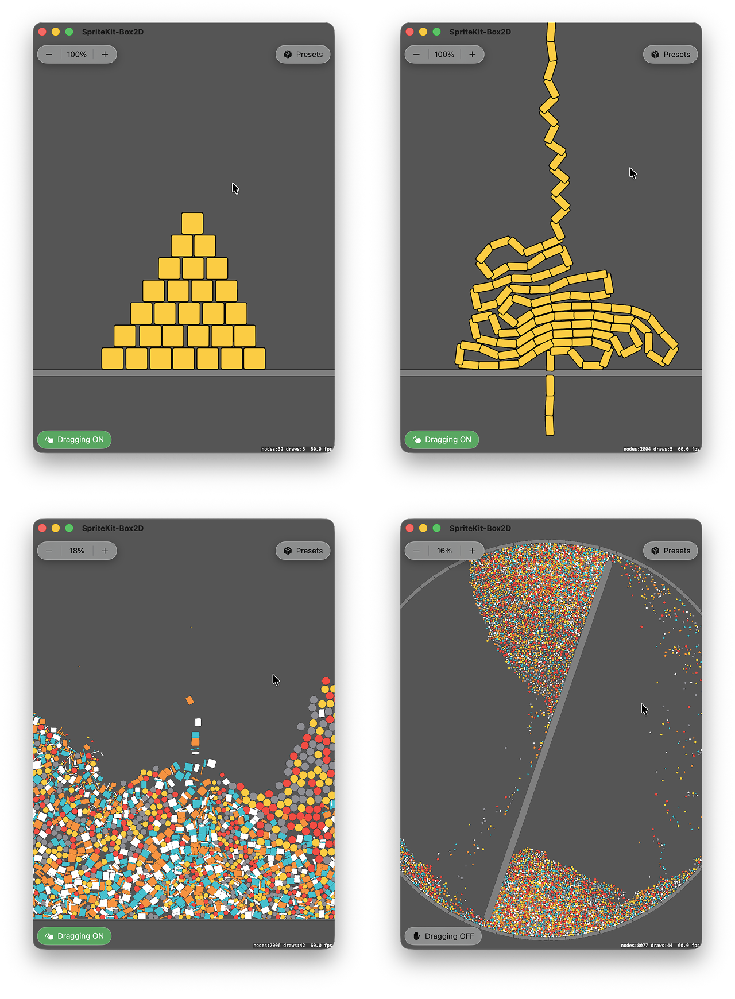
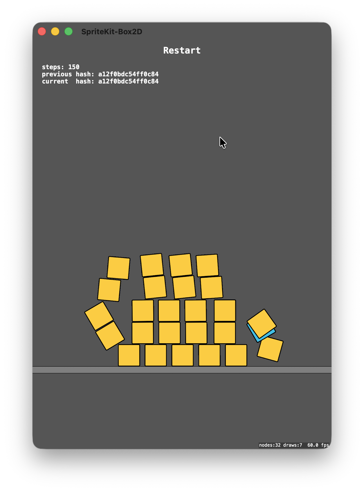

# SpriteKit Box2D

This project shows how to integrate Box2D 3.x.x with SpriteKit.



## Videos

- [What Do You See](https://www.achrafkassioui.com/images/SpriteKit%20-%20Box2D%20v3%20-%20What%20Do%20You%20See.mov) (75MB)
- [Falling Chain - 2](https://www.achrafkassioui.com/images/SpriteKit%20-%20Box2D%20v3%20-%20Falling%20Chain%20-%202.mov) (43MB)
- [Falling Chain - 1](https://www.achrafkassioui.com/images/SpriteKit%20-%20Box2D%20v3%20-%20Falling%20Chain%20-%201.mov) (14MB)
- [Long Chain with Revolute Joint - With Self Collision](https://www.achrafkassioui.com/images/SpriteKit%20-%20Box2D%20v3%20-%20Chain%20Revolute%20With%20Collision.mov) (263MB)
- [Long Chain with Revolute Joint - No Self Collision](https://www.achrafkassioui.com/images/SpriteKit%20-%20Box2D%20v3%20-%20Chain%20Revolute%20No%20Collision.mov) (87MB)
- [Chain with Revolute Joint - High Damping - 1](https://www.achrafkassioui.com/images/SpriteKit%20-%20Box2D%20v3%20-%20Chain%20with%20Rovolute%20-%201.mov) (28MB)
- [Chain with Revolute Joints - High Damping - 2](https://www.achrafkassioui.com/images/SpriteKit%20-%20Box2D%20v3%20-%20Chain%20with%20Rovolute%20-%202.mov) (23MB)
- [SpriteKit Noise Field + Box2D](https://www.achrafkassioui.com/images/SpriteKit%20-%20Box2D%20v3%20-%20Noise%20Field.mov) (100MB)
- [Stack with High Restitution](https://www.achrafkassioui.com/images/SpriteKit%20-%20Box2D%20v3%20-%20High%20Restitution.mov) (83MB)
- [Box2D Explode Effect](https://www.achrafkassioui.com/images/SpriteKit%20-%20Box2D%20v3%20-%20Explode.mov) (113MB)

## How to Run

- You need a Mac with Xcode, and optionally an iOS device.
- Download this project and open it in Xcode.
- Update signing to use your Apple Developer account.
- Select a target device or simulator.
- For best performance, run the app with a Release build instead of Debug.
- Build and run.
- Enjoy the amazing Box2D version 3 with SpriteKit.

Try various values of the preset functions, such as:

```swift
static func pyramid(_ scene: SpriteKit_Box2D.Scene) {
    scene.removeContent()
    scene.setupBox2D(gravityY: -10) /// Gravity strength
    scene.createGround(width: 2000)
    scene.createPyramid(baseCount: 7, startY: -200) /// Pyramid width and initial height
}
```

Or navigate to the factory functions and change them directly.

## Swift & C

Box2D version 3 is written in C. This projects shows how to use C and Swift in the same Xcode project. See [this tutorial on how to mix Swift with C](https://github.com/AchrafKassioui/Learning-iOS-Dev#swift--c).

## Minimal Setup

To run Box2D with SpriteKit, a [minimal scene](SpriteKit-Box2D/Scenes/MinimalSetup.swift) can be structured as follows:

- Create a Box2D world. In SpriteKit, the equivalent was SKPhysicsWorld, which is automatically created with every scene.
- Create SpriteKit visual nodes. SpriteKit will handle rendering.
- For each visual node, create a Box2D body with a collision shape that represents it in the simulation.
- Link each SpriteKit node to its Box2D body. For example, create an `Entity` struct that references both, then store entities in a data structure.
- For each frame, step the Box2D simulation with a fixed timestep, typically 1/60 second.
- Before SpriteKit renders the frame, get the simulation result by applying Box2D transforms to SpriteKit nodes.

For a minimal setup, stepping Box2D directly from SpriteKit `update(_:)` is enough. For a production app, use a fixed-step accumulator so Box2D updates steadily even if the rendering engine draws at 60 fps, 120 fps, or with occasional frame drops.

## Update and Fixed Update

A physics engine advances with a given increment of time called a timestep, typically 1/60 second. In Box2D, the method that tells the engine to simulate one additional increment of time is called `b2World_Step`, and it takes a timestep.

Usually, the goal of the simulation is to stay in sync with real time. 3 seconds of wall-clock time should simulate 3 seconds of physics time. But if we call `b2World_Step` directly from `update(_:)`, we depend on how steady the render refresh cycle is: a frame may take too long before calling the next update, or the device might be running at 120fps, twice the physics rate.

If we pass the same timestep regardless of rendering speed, we may get slow/fast physics motion depending on update speed. If we pass a variable timestep to the physics engine, we won't get similar results, because a physics solver doesn't produce the same outcome from different increments of time.

We need a fixed update. A fixed update is a function that keeps simulation time aligned with real-time. A common way to implement it is with the accumulator pattern, documented in Glenn Fiedler's classic [Fix Your Timestep!](https://gafferongames.com/post/fix_your_timestep/) post. It works like this:

- Each render update, calculate how much real time passed since the previous update.
- Add that delta time to an accumulator.
- If the accumulator is greater than or equal to the fixed timestep, run one fixed update.
- Subtract one fixed timestep from the accumulator.
- If the accumulator is still greater than or equal to the fixed timestep, run another fixed update.
- If the accumulator is smaller than the fixed timestep, stop and let the render update continue.

With this pattern, the rendering engine may provide variable time, but the accumulator converts it into stable ticks.

In SpriteKit, the implementation looks like this:

```swift
class MyScene: SKScene {

    private let fixedTimestep: TimeInterval = 1 / 60
    private var lastUpdateTime: TimeInterval?
    private var accumulatedTime: TimeInterval = 0 /// The accumulator

    override func update(_ currentTime: TimeInterval) {
        /// Calculate delta time
        guard let lastUpdateTime else {
            lastUpdateTime = currentTime
            return
        }
        let deltaTime = currentTime - lastUpdateTime
        self.lastUpdateTime = currentTime

        /// Accumulate time from display refresh cycle
        accumulatedTime += deltaTime

        /// Run code that updates once per rendered frame
        //..
        
        /// Check if enough real time has passed to run fixed update
        while accumulatedTime >= fixedTimestep {
            /// Run code on fixed ticks
            fixedUpdate(fixedTimestep)
            accumulatedTime -= fixedTimestep
        }
    }
    
    func fixedUpdate(_ fixedTimestep: TimeInterval) {
        /// Run the Box2D simulation with a fixed time increment
		b2World_Step(b2WorldId, Float(fixedTimestep), 4)
    }

}
```

Notice that:

- SpriteKit's `update(_:)` passes the current time, not delta time, so we calculate delta time ourselves.
- Per-frame code can run before or after the fixed update. Choose the order that matches your app.
- Box2D should receive the same fixed timestep each step.
- Be careful of the spiral of death: if the app gets too slow, the accumulator grows faster than the app can empty it. Production code would cap the delta time or number of fixed updates per frame.

In this project, fixed update is called in `didSimulatePhysics`, not in `update(_:)`. `didSimulatePhysics` is executed after SpriteKit has evaluated actions and simulated its own physics. This lets the app pass SpriteKit action or physics results into Box2D before stepping Box2D, if needed later. You may choose a different structure.

## Timestep

The physics engine doesn't have to run in sync with real-time. We could speed up or slow down the rate at which each step is called, using a time scale parameter:

```swift
class MyScene: SKScene {

    /// 1 = normal speed, 0.5 = slow motion, 2 = fast forward.
    private var timeScale: CGFloat = 1
    
    override func update(_ currentTime: TimeInterval) {
        ///...

        /// Use the time scale for accumulating time
        accumulatedTime += deltaTime * timeScale
        
        ///...
    }
}
```

If we use a time scale of 2, fixed update will be called twice more often, and the physics engine will simulate 2 seconds in 1 second of real-time. How fast can we advance in time? Ignoring rendering, as fast as the computer can process a step.

If we use a time scale of 0.5 or 0.1, physics will only be updated 30 or 6 times per second, respectively. The motion will appear jagged, unless a rendering-side interpolation is added.

Regardless of time scale, the physics engine should produce the same result after the same number of steps, because each step still uses the same timestep. Time scale changes how often we call fixed update relative to real time. It does not change the size of each physics step.

What happens if we change the timestep? A simulation stepped at `1/60` and a simulation stepped at `1/120` are not the same simulation. They produce different results. Many applications use `1/60` or 60Hz as default. But shorter timesteps can be very interesting. For example, in this project, switching the timestep to `1/120` on a ProMotion device makes dragging significantly more responsive.

That happens because dragging is controlled by a motor joint. Each fixed step updates the pointer body and gives the joint a new target. At `1/120`, the target is updated twice as often as at `1/60`, so the dragged body follows touch input with less delay. The tradeoff is cost: the physics engine now has to process twice as many steps for the same amount of simulated time on all devices it runs on, regardless of the rendering refresh rate.

In conclusion, time scale changes how fast fixed steps are consumed in real time. The timestep changes the simulation itself.

## Determinism

Box2D determinism is truly remarkable. Given identical inputs, Box2D produces bit-for-bit identical results across multiple runs. This makes rollback, replay, and reproducible simulation possible.



To explore determinism, I set up [a test scene](SpriteKit-Box2D/Scenes/Determinism.swift) such as:

- A new Box2D world is created each time content is reset.
- The same bodies are recreated in the same order.
- The simulation runs for a fixed number of physics steps, then pauses.
- After that fixed step count, a hash of all body transforms is generated.
- Identical hash between runs = identical transform state = the simulation is deterministic.

### Findings

Box2D is deterministic, provided:

- A new physics world is created for each replay or reset.
- The same world settings, fixed timestep, and substep count are used.
- Bodies are created in the same order.
- The same initial positions, rotations, velocities, and forces / impulses are applied.

Creation order is important and part of the simulation input.

### Creation Order

A transient body test explores the creation order question further: creating and destroying an extra body during the simulation to see if its presence would affect the outcome of the remaining bodies.

Test A:

- A body is created and destroyed after all boxes have been created.
- I compare the hash of the boxes with and without that transient body.
- I get the same hash.

Test B:

- A body is created after the ground and before the boxes, configured to not collide with them.
- I compare the hash of the boxes with and without that transient body.
- I get the same hash.

Test C:

- A body is created inside the box creation loop, between two box bodies, at different insertion indexes.
- The transient body is configured to not collide with the boxes.
- I compare the hash of the boxes with and without that transient body.
- I get the same hash.

It seems that if a body was created but did not collide with the rest of the simulation, its creation order did not affect the outcome of the other bodies.

## References

- Erin Catto, [Box2D](https://github.com/erincatto/box2d), GitHub repository.
- Glenn Fiedler, [Fix Your Timestep!](https://gafferongames.com/post/fix_your_timestep/), 2004. Used to implement a fixed update in SpriteKit.
- Erin Catto, [Determinism](https://box2d.org/posts/2024/08/determinism/). Used to setup the Determinism test scene.
- [Modules](https://clang.llvm.org/docs/Modules.html), Clang documentation.
- Luiz Fernando, [SwiftBox2D](https://github.com/LuizZak/SwiftBox2D), a Swift wrapper around Box2D. I used it to kickstart this project, then I removed the dependency and included the Box2D code directly, plus some minimal Swift conformance and wrappers. Thanks Luiz for the kickstart.
